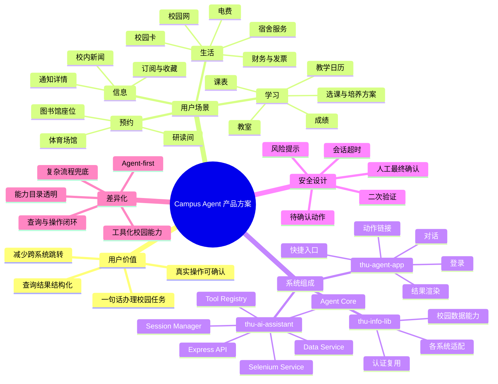
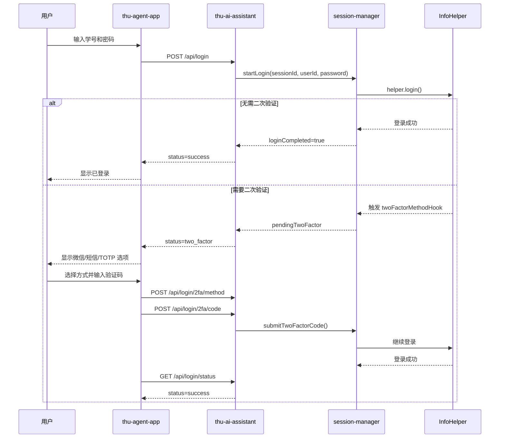
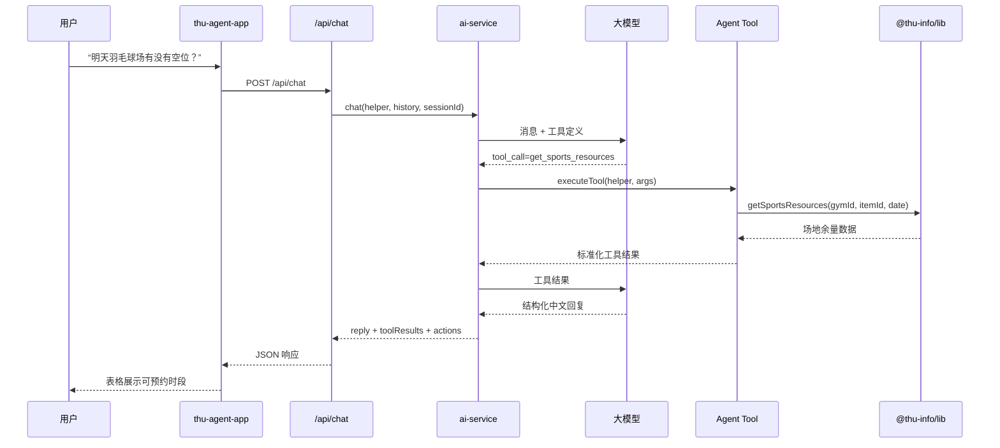
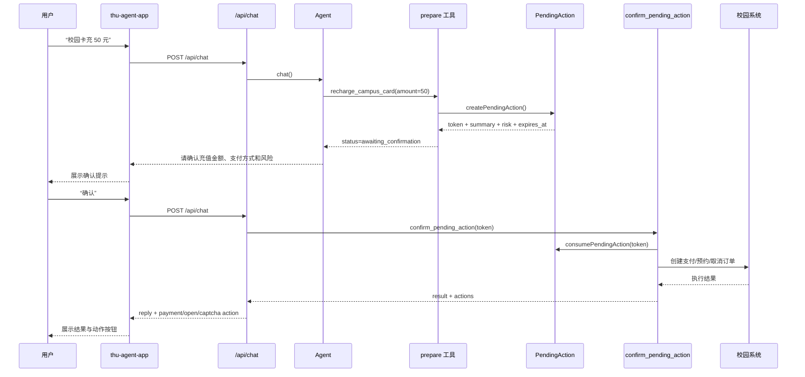
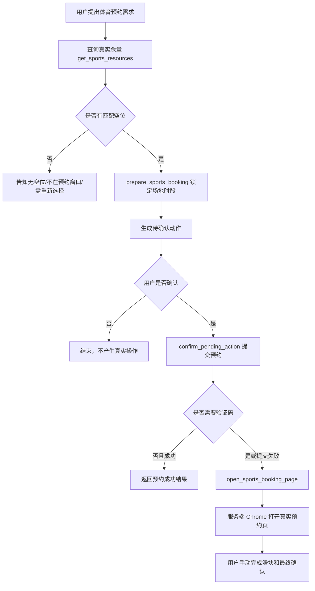

# 模块二：产品方案设计

## 1. 产品概述

### 1.1 产品定位

本产品暂定名为 **Campus Agent 清华校园智能助手**。它不是传统校园 App 中“功能宫格 + 手动点击”的又一层入口，而是以自然语言对话为核心，把清华校内学习、生活、预约和信息查询能力封装为可被大模型调用的工具，并通过独立移动端 `thu-agent-app` 与后端 `thu-ai-assistant` 组成完整的 Agent-first 校园服务体验。

一句话概括：**Campus Agent 是面向清华师生的对话式校园办事助手，用户只需说出目标，系统自动理解意图、调用校园工具、整理结果，并在真实操作前进行确认。**

当前实现中，移动端负责登录、对话、能力入口、结果渲染和支付/预约动作入口；后端负责会话管理、二次验证、工具注册、模型调用、校园数据查询、预约/支付动作确认和部分浏览器自动化；底层校园数据能力复用 `@thu-info/lib`。

### 1.2 目标用户

产品的核心目标用户是清华校内学生，兼顾需要频繁处理校园事务的研究生、助教和校内工作人员。

典型用户画像如下：

| 用户类型 | 典型需求 | 当前痛点 | 产品价值 |
|---|---|---|---|
| 本科生 | 查课表、查成绩、查体育场地、查校园卡余额 | 校园系统入口多，查询路径长，信息分散 | 用一句话完成跨系统查询，结果直接结构化展示 |
| 研究生 | 查收入、查研读间、查图书馆资源、查通知 | 研读间/财务/通知系统分散，操作频率高 | 将常用高频流程收敛到对话入口 |
| 住宿学生 | 查电费、查宿舍卫生成绩、查校园网设备 | 生活服务散落在不同页面，移动端操作繁琐 | 快速查询余额、记录和设备状态 |
| 重度校园 App 用户 | 同时使用课表、图书馆、体育、校园卡等功能 | 需要记住每个功能在哪、怎么填参数 | Agent 根据语义补齐流程，减少点击和记忆成本 |

### 1.3 用户痛点

1. **入口碎片化**：课表、成绩、校园卡、图书馆、体育场馆、校园网等功能分布在不同系统或 App 页面中，用户需要知道“去哪里查”。
2. **操作链路长**：预约体育场馆、查询研读间、查找图书馆座位等任务需要多次选择日期、场馆、楼层、区域和时段。
3. **语义门槛高**：用户自然表达通常是“明天羽毛球还有空位吗”“帮我看今天下午有没有课”，而传统系统要求用户先转换成固定筛选条件。
4. **结果不易读**：原始系统返回的数据格式不统一，用户需要在多个页面之间比较可用时间、费用、状态和限制。
5. **真实动作风险高**：充值、预约、取消预约、设备登录/登出等操作一旦误触会产生支付、占用资源或影响网络连接，需要明确确认机制。

### 1.4 使用场景

| 场景 | 用户表达 | 系统行为 |
|---|---|---|
| 课表查询 | “今天下午有什么课？” | 调用课表工具，按星期和节次整理课程、地点与当前周次 |
| 体育余量查询 | “明天羽毛球场有没有空位？” | 匹配羽毛球相关场馆，查询日期余量，按场馆/场地/时段展示 |
| 校园卡查询 | “查一下我的校园卡余额” | 调用校园卡工具，返回余额、状态和过渡余额 |
| 校园卡充值 | “校园卡充 50 元” | 创建待确认动作，用户确认后才生成支付订单并返回二维码动作 |
| 图书馆座位 | “查北馆今天有哪些空座” | 按图书馆、楼层、区域逐步查询座位余量 |
| 研读间预约 | “帮我预约明天 10:00-11:00 的研读间” | 查询可用资源，生成待确认动作，确认后提交预约 |
| 校内通知 | “查一下最新校内通知” | 查询新闻通知列表，按标题、来源、日期结构化展示 |

## 2. 核心功能

### 2.1 对话式校园任务入口

`thu-agent-app` 的第一屏即为 Agent 对话，而不是传统功能宫格。用户输入自然语言后，App 将消息发送到 `/api/chat`，由 `thu-ai-assistant` 判断意图、调用工具并生成结构化中文回复。

当前移动端已实现：

| 能力 | 说明 |
|---|---|
| 后端地址配置 | 支持 Android 模拟器默认 `http://10.0.2.2:3000`，也支持真机局域网 IP |
| 健康检查 | 调用 `/api/health` 与 `/api/capabilities`，展示服务状态和能力数量 |
| 登录态展示 | 展示未登录、登录中、二次验证、已登录、登录失败等状态 |
| 对话输入 | 支持校园任务自然语言输入 |
| 快捷提示 | 提供课表、校园卡、研读间、体育等高频 prompt |
| Markdown 渲染 | 支持标题、列表、加粗、代码、链接等基础格式 |
| 动作链接渲染 | 识别支付链接、预约页面、体育验证码提示等动作标记 |

### 2.2 统一登录与二次验证

后端通过 `session-manager.ts` 管理 `InfoHelper` 实例和登录态。用户登录后，同一会话内所有工具复用已认证的 `InfoHelper`，避免每次查询重复登录。

登录流程支持：

| 流程节点 | 实现方式 |
|---|---|
| 创建会话 | `/api/login` 创建 `sessionId` 并初始化聊天历史 |
| 启动登录 | `sessionManager.startLogin()` 创建 `InfoHelper` 并调用 `helper.login()` |
| 二次验证方式选择 | 支持微信、短信、TOTP 三类验证方式 |
| 验证码提交 | `/api/login/2fa/code` 将验证码交回登录 Promise |
| 固定设备指纹 | 基于 userId 生成固定 fingerprint，减少重复二次验证 |
| 会话超时 | 会话默认 2 小时超时 |
| 登出 | `/api/logout` 清理后端会话与浏览器 session |

### 2.3 校园能力目录

后端通过 `/api/capabilities` 暴露能力目录。能力分为 `ready`、`partial`、`planned` 三类，既能让用户知道当前能做什么，也能让 Agent 在回答“你能做什么”时调用真实能力表，避免幻觉式承诺。

| 分类 | 能力 | 状态 | 主要工具 |
|---|---|---|---|
| 学习 | 课程表 | ready | `get_schedule` |
| 学习 | 成绩单 | ready | `get_report`, `peek_course_score` |
| 学习 | 教学日历 | ready | `get_calendar`, `get_school_calendar_image` |
| 学习 | 教室查询 | ready | `get_classroom` |
| 学习 | 选课、培养方案与评教 | partial | `get_course_registration_info`, `search_course_registration_courses`, `get_degree_program_info`, `get_teaching_assessment_list` |
| 学习 | 体测成绩 | ready | `get_physical_exam` |
| 生活 | 校园卡 | ready | `get_card_info`, `get_campus_card_transactions`, `recharge_campus_card` |
| 生活 | 宿舍电费 | partial | `get_electricity`, `get_electricity_records`, `prepare_electricity_recharge` |
| 生活 | 宿舍服务 | partial | `get_dorm_score`, `prepare_reset_dorm_password` |
| 生活 | 财务、收入与发票 | partial | `get_bank_payment`, `get_graduate_income`, `get_invoice_list` |
| 生活 | 校园网 | partial | `get_network_info`, `get_online_devices`, `prepare_network_device_action` |
| 预约 | 体育场馆 | partial | `get_sports_resources`, `prepare_sports_booking`, `cancel_sports_booking`, `open_sports_booking_page` |
| 预约 | 图书馆与研读间 | partial | `get_library`, `get_library_seats`, `prepare_library_seat_booking`, `prepare_library_room_booking`, `cancel_library_booking` |
| 信息 | 校内新闻通知 | ready | `get_news`, `get_news_detail`, `get_news_subscriptions`, `get_news_favorites` |
| 学习 | 教参平台 | partial | `search_reserves_library`, `get_reserves_library_detail` |
| 生活 | 饮水、洗衣和地图 | planned | `get_life_service_status` |

### 2.4 查询类工具

查询类工具的目标是“自动取数 + 结构化表达”。模型不直接编造结果，而是通过工具拿到后端 JSON，再按系统提示词规定的表格、列表或信息卡格式输出。

| 查询领域 | 用户价值 | 输出形式 |
|---|---|---|
| 课程表 | 快速知道今天、明天或本周课程安排 | 按星期/节次表格展示 |
| 成绩 | 查询成绩、绩点、学期汇总 | 课程成绩表 + GPA 摘要 |
| 体育场馆 | 查看可预约场地、时段、费用 | 场馆/场地/时段/状态/费用表格 |
| 校园卡 | 查看余额和消费记录 | 信息卡或交易记录列表 |
| 电费 | 查看宿舍电费余额和充值记录 | 信息卡 + 记录列表 |
| 图书馆 | 查看图书馆、楼层、区域、座位和研读间资源 | 分层候选列表 |
| 新闻通知 | 获取最新通知、详情、订阅、收藏 | 编号列表 + 日期来源 |
| 教室 | 查看教室状态 | 教学楼/教室/容量/状态表 |
| 校园网 | 查看账号、余额、在线设备 | 信息卡 + 设备列表 |

### 2.5 真实动作与确认机制

真实动作包括充值、预约、取消预约、支付、设备登录/登出等。产品方案中采用“准备动作 -> 用户确认 -> 执行动作”的统一协议。

当前后端已实现 `pending-actions` 机制：

1. 用户提出真实动作，例如“校园卡充 50 元”。
2. Agent 调用对应 prepare 工具，例如 `recharge_campus_card`。
3. 工具创建 `PendingAction`，返回 `confirmation_token`、摘要、风险等级和过期时间。
4. Agent 向用户复述动作摘要和风险，请用户确认。
5. 用户明确回复“确认/执行/充值/确定”等表达。
6. `/api/chat` 检测确认意图后调用 `confirm_pending_action`。
7. 后端执行真实动作，并通过 `actions` 字段把支付二维码、打开链接或验证码面板交给前端渲染。

该机制解决了 Agent 产品中最关键的安全问题：**模型可以帮助用户准备操作，但不能在用户未确认时直接产生真实后果。**

### 2.6 体育预约兜底能力

体育预约是当前实现中最复杂的场景。系统同时提供两条路径：

| 路径 | 适用场景 | 实现 |
|---|---|---|
| API 查询路径 | 查询余量、筛选可预约场地、准备预约参数 | `InfoHelper.getSportsResources` + `data-service.ts` |
| Selenium 交互路径 | 打开真实预约页、处理滑块验证码、人工完成最终确认 | `sports-selenium-service.ts` |

当直接提交预约遇到验证码或系统限制时，后端可打开真实体育预约页面，并复用当前登录态与体育系统 token，由用户在 Chrome 窗口或验证码辅助面板中完成最后一步。

## 3. 产品架构与功能图

### 3.1 总体架构图

```mermaid
flowchart TB
    U[清华学生/用户] --> APP[thu-agent-app<br/>React Native 独立移动端]

    APP -->|HTTP + Cookie Session| API[thu-ai-assistant<br/>Express API 服务]

    API --> AUTH[Auth Routes<br/>登录/2FA/登出]
    API --> CHAT[Chat Routes<br/>对话与历史管理]
    API --> CAP[Capabilities Routes<br/>能力目录]
    API --> CARD[Card Routes<br/>校园卡充值 API]
    API --> SPORTAPI[Sports Routes<br/>体育查询/预约/验证码]

    CHAT --> AGENT[Agent Core<br/>ai-service 工具调用循环]
    AGENT --> PROMPT[System Prompt<br/>行为约束/格式规范/确认协议]
    AGENT --> LLM[LLM Client<br/>GLM API + tools]
    AGENT --> TOOLS[Tool Registry<br/>agent/tools]

    AUTH --> SESSION[Session Manager<br/>InfoHelper 复用/2FA/PendingAction]
    CHAT --> SESSION
    TOOLS --> SESSION

    TOOLS --> DATA[THU Data Service<br/>校园数据适配层]
    DATA --> LIB[@thu-info/lib<br/>底层校园系统能力]
    SPORTAPI --> SEL[Selenium Sports Service<br/>Chrome 自动化/验证码辅助]
    SEL --> SPORTS[体育预约系统]
    LIB --> CAMPUS[清华校内系统<br/>课表/成绩/校园卡/图书馆/新闻等]

    LLM --> MODEL[大模型服务]
```

### 3.2 后端分层架构图

```mermaid
flowchart LR
    subgraph Interface[接口层 routes]
        R1[/api/health/]
        R2[/api/login, /api/login/2fa/*/]
        R3[/api/chat/]
        R4[/api/capabilities/]
        R5[/api/card/recharge/]
        R6[/api/sports/*/]
    end

    subgraph Orchestration[编排层 agent/session]
        S[session-manager<br/>会话、2FA、登录态、待确认动作]
        A[ai-service<br/>工具调用主循环]
        P[prompt<br/>输出格式与安全协议]
        L[llm-client<br/>大模型工具调用]
    end

    subgraph ToolLayer[工具层 agent/tools]
        T1[查询工具<br/>课表/成绩/校园卡/电费/新闻]
        T2[预约工具<br/>体育/图书馆/研读间]
        T3[确认工具<br/>list/confirm pending actions]
        T4[扩展工具<br/>选课/财务/校园网/教参]
    end

    subgraph ServiceLayer[服务层 services]
        D[data-service<br/>JSON 结果适配]
        SS[sports-selenium-service<br/>浏览器自动化]
    end

    subgraph Base[基础能力]
        I[@thu-info/lib]
        C[清华校内系统]
        B[Chrome/Selenium]
    end

    Interface --> Orchestration
    Orchestration --> ToolLayer
    ToolLayer --> ServiceLayer
    D --> I --> C
    SS --> B --> C
```

### 3.3 功能结构图

```mermaid
flowchart TB
    Product[Campus Agent 清华校园智能助手]

    Product --> Client[移动端 thu-agent-app]
    Client --> C1[会话连接与后端地址配置]
    Client --> C2[登录与二次验证输入]
    Client --> C3[对话式任务输入]
    Client --> C4[能力快捷入口]
    Client --> C5[Markdown 结果渲染]
    Client --> C6[支付/预约/验证码动作渲染]

    Product --> Backend[后端 thu-ai-assistant]
    Backend --> B1[登录认证]
    Backend --> B2[Agent 对话]
    Backend --> B3[校园工具注册]
    Backend --> B4[待确认动作]
    Backend --> B5[体育 Selenium 自动化]
    Backend --> B6[能力目录]

    Product --> Capability[校园能力]
    Capability --> L1[学习<br/>课表/成绩/日历/教室/选课/体测/教参]
    Capability --> L2[生活<br/>校园卡/电费/宿舍/校园网/财务/发票]
    Capability --> L3[预约<br/>体育场馆/图书馆座位/研读间]
    Capability --> L4[信息<br/>校内新闻/通知/订阅/收藏]

    Product --> Safety[安全机制]
    Safety --> S1[会话隔离]
    Safety --> S2[2FA 支持]
    Safety --> S3[真实动作二次确认]
    Safety --> S4[风险等级与过期时间]
    Safety --> S5[支付二维码不直接塞入正文]
```



### 3.4 产品思维导图



## 4. 交互流程

### 4.1 登录与二次验证流程



### 4.2 查询类对话流程



### 4.3 真实动作确认流程



### 4.4 体育预约兜底流程



## 5. 创新与差异化

### 5.1 从功能入口转向任务入口

传统校园 App 的核心是“用户找到功能，再填写表单”。Campus Agent 的核心是“用户表达目标，系统选择工具”。例如用户不需要先进入体育、选择场馆、选择日期，而是直接说“明天羽毛球有没有空位”。系统负责从自然语言中抽取运动类型、日期和查询意图，再调用对应工具。

### 5.2 以工具调用降低大模型幻觉

系统不是让大模型凭记忆回答校园信息，而是把校园能力拆成明确的工具函数，例如 `get_schedule`、`get_sports_resources`、`get_card_info`、`get_library_seats`。模型负责理解意图和组织表达，真实数据来自工具结果。这种设计能显著降低校园信息场景中最危险的“编造余额、编造空位、编造成绩”问题。

### 5.3 查询与真实动作分层

产品没有把所有能力都做成自动执行。对于查询类任务，系统可以直接返回结果；对于充值、预约、取消等真实动作，必须先生成待确认动作，再等待用户明确确认。这种分层使 Agent 既有办事能力，又不会因为误识别或误触造成资金、预约资源或账号状态变化。

### 5.4 能力目录透明化

`/api/capabilities` 将功能按 `ready`、`partial`、`planned` 标记，避免用户误以为所有校园任务都已完全自动化。Agent 在用户询问能力时优先读取能力目录，能够清楚说明“哪些已经可用、哪些只能查询、哪些仍是计划能力”。

### 5.5 复杂流程的人机协同兜底

体育预约存在滑块验证码、预约窗口限制、支付或最终确认等复杂情况。产品没有强行宣称全自动，而是设计了 Selenium 打开真实预约页、复用登录态、用户手动完成验证码和最终确认的兜底路径。这种方式更符合校园系统的实际约束，也让产品在 MVP 阶段具备可演示和可扩展的真实链路。

### 5.6 独立 App 形态便于快速验证

`thu-agent-app` 是独立包名 `com.campusos.agent` 的移动端 Demo，不依赖改造原有 `thu-info-app` 首页。这样可以在不影响原 App 稳定性的前提下快速验证 Agent-first 交互、工具调用协议、真实动作确认机制和结果渲染方式。

## 6. 模块二小结

Campus Agent 的产品方案围绕“自然语言校园任务入口”展开：前端通过独立移动端提供登录、对话和动作渲染；后端通过 Express、Session Manager、Agent 工具注册和 `@thu-info/lib` 把清华校内系统能力统一封装；大模型只负责意图理解、工具选择和结果表达；真实动作统一纳入待确认协议。

该方案的核心优势在于：**把分散校园系统整合成一个可对话、可查询、可确认、可扩展的校园 Agent 平台**。在当前实现基础上，它已经具备课程表、成绩、校园卡、电费、体育、图书馆、新闻、教室、财务、校园网等多类校园能力的统一入口，并为后续扩展更多真实办事流程留下了清晰架构。
